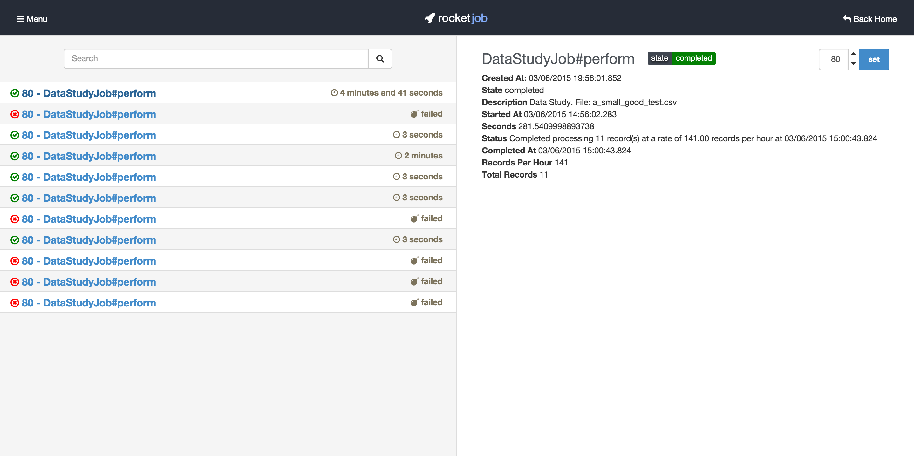
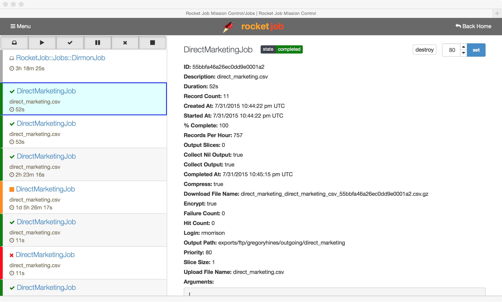
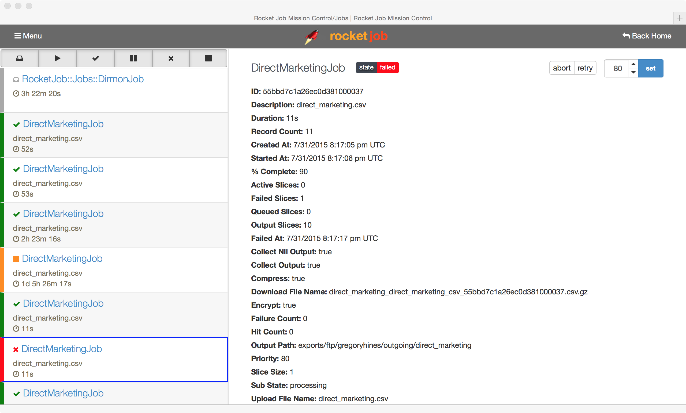
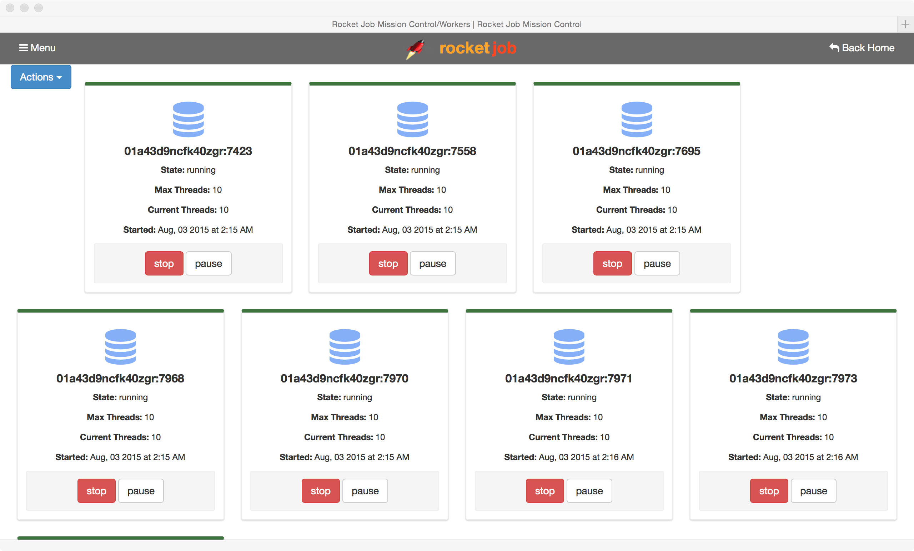
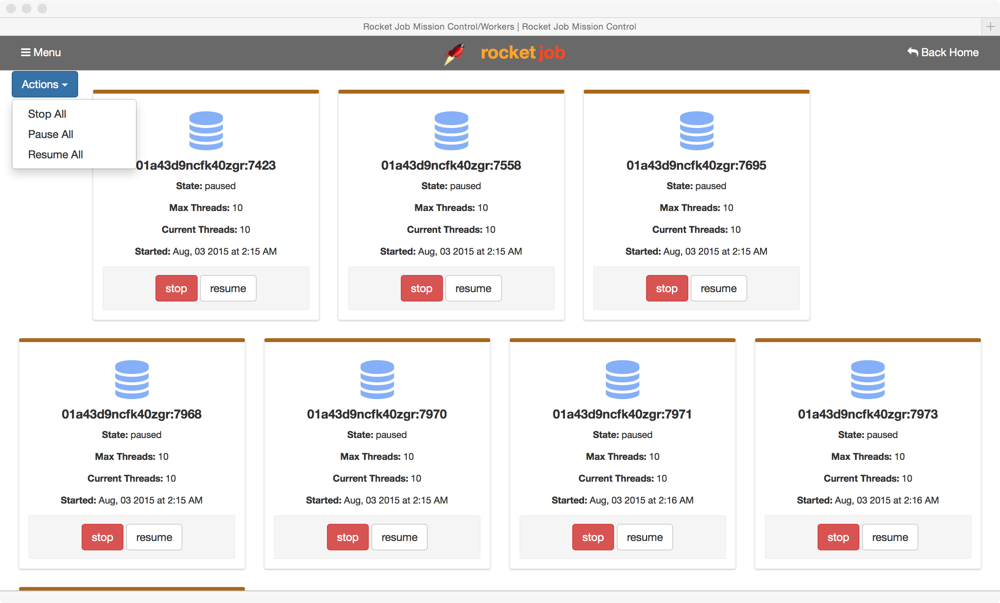

## Mission Control

[Mission Control][1] is the Web user interface to manage [rocketjob][0] jobs.



[Mission Control][1] first opens with the list of jobs in the system, listed in reverse chronological order.
I.e. With the newest job at the top.

Each job entry in the list includes:

* The class name of the job
* An icon indicating the state of the job
* A duration indicating:
    * For completed jobs: How long the job took to run.
    * For queued jobs: How long the job has been queued for.
    * For running jobs: How long the jobs has been processing.
    * For aborted or failed jobs: How long the job had been processing until it was failed or aborted.
* For running jobs, it also includes a progress bar indicating the percent complete.

### Features

* View all queued, running, failed, and running jobs
* View all completed jobs where `destroy_on_complete == false`
* Pause any running jobs
* Resume paused jobs
* Retry failed jobs
* Abort, or fail queued or running jobs
* Destroy a completed or aborted job


### Managing Jobs

Select a job in [Mission Control][1] to see more details about the status of that job:



Based on the state of the job, the relevant actions will appear:

* `retry`
    * When a job has failed, it can be resumed / retried by hitting the `retry` button.
* `pause`
    * Pause a `running` or `queued` job to temporarily stop processing on the job.
    * The job will only continue processing once the `resume` button is hit.
    * Note: `pause` and `resume` is intended for jobs derived from `RocketJob::SlicedJob` since
      those jobs can be pre-empted during processing. Otherwise, the job needs to manually perform
      checks to see if the job is paused and halt processing.
* `resume`
    * Resume a `paused` job so that it can continue processing again.
* `fail`
    * Fail a `running` or `queued` job so that no more processing will occur.
    * All input & output collections will be cleaned up for jobs derived from `RocketJob::SlicedJob`.
    * The job can be retried later after it has failed.
* `abort`
    * Abort a `running` or `queued` job so that no more processing will occur.
    * All input & output collections will be cleaned up for jobs derived from `RocketJob::SlicedJob`.
    * The job _cannot_ be retried after it has been aborted.
* `destroy`
    * Destroy the job entirely from the system.



### Active Workers

To see the active workers, select `Menu` on the top right of the screen and select `Workers`.



### Managing Workers

Each worker can be managed individually, or to pause all current work, click on `Actions` and select `Pause All`.



The workers can be resumed later by clicking on `Actions` and selecting `Resume All`.

To shutdown all workers via [Mission Control][1], click on `Actions` and select `Stop All`.

## Installation

[rocketjob mission control][1] is a rails engine that can be added to any existing Rails 4 or
Rails 5 rails application.

Add the [rocketjob mission control][1] gem to your Gemfile

```ruby
   gem 'rocketjob_mission_control', '~> 0.10'
```

Now run `bundle` to install [rocketjob mission control][1]

Add the following line to `config/routes.rb` in your Rails application:

```ruby
mount RocketJobMissionControl::Engine => 'rocketjob'
```

### [Next: API ==>](api.html)

[0]: http://rocketjob.io
[1]: https://github.com/rocketjob/rocketjob_mission_control
